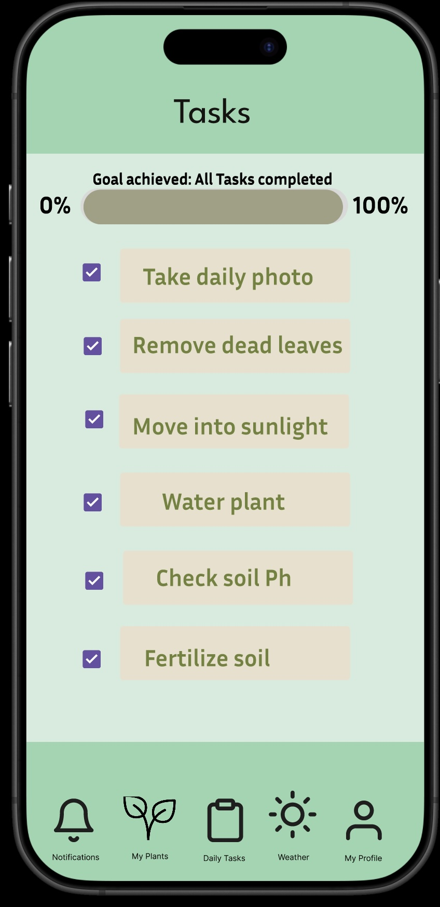

# My Garden App – Figma Prototype 🌱

This is a Figma-based prototype for a gardening assistant app, designed to help new gardeners track weather, daily tasks, and plant care.

🔗 [View Figma Prototype](https://www.figma.com/proto/R2aIkel86rudRhEIHjvRJc/352-Prototype?node-id=21-204&starting-point-node-id=1%3A3)

---

## 📸 Screenshots

  

---

## 🧩 Features
- Weather and grow zone tracking
- Daily task checklist with visuals
- Plant info manager with tabs
- Fun trivia section for engagement

## 🛠 Tools
- Figma (UI/UX Design)
- Nielsen's Heuristics applied in design
- User-tested with think-aloud protocol

## 📫 Notes
This is a design prototype only — no functional code is included.  
Contact me for usability findings or annotated walkthroughs!

## Figma references:
Prototype created using Figma, Figma Inc., 2025.

https://www.figma.com/

Bell, clipboard, sun, user, upload, edit, arrow, smile, globe, navigation, setting cog, fonts by Figma under CC by 4.0, 2025

https://www.figma.com/community/file/1380235722331273046

Search, checkbox, label, avatar image by Google under CC by 4.0, 2025

https://www.figma.com/community/file/1035203688168086460

 
Plant icon image by Pixel perfect from Flaticon, licensed under Flaticon, free for personal and commercial purpose with attribution, Accessed May 13, 2025.

https://www.flaticon.com/free-icon/plant_497393?term=plant&page=1&position=3&origin=tag&related_id=497393

 

Garden Design. “Understanding USDA Plant Hardiness Zone 8”, Accessed May 13, 2025.

https://www.gardendesign.com/zone/8.html

 
 Images of flowers taken by me, Sienna Raigoza, March 27, 2022.
 
---

© 2025 Sienna R.
